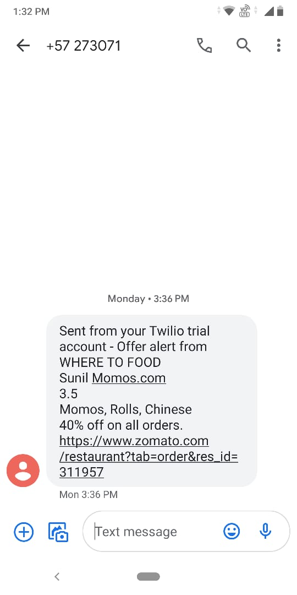
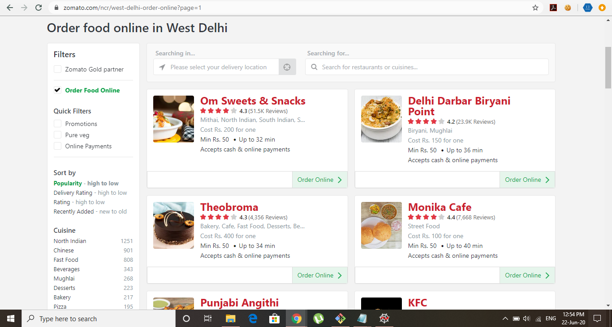
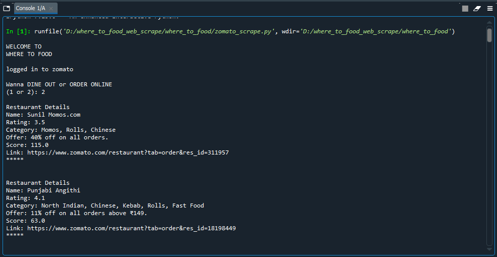
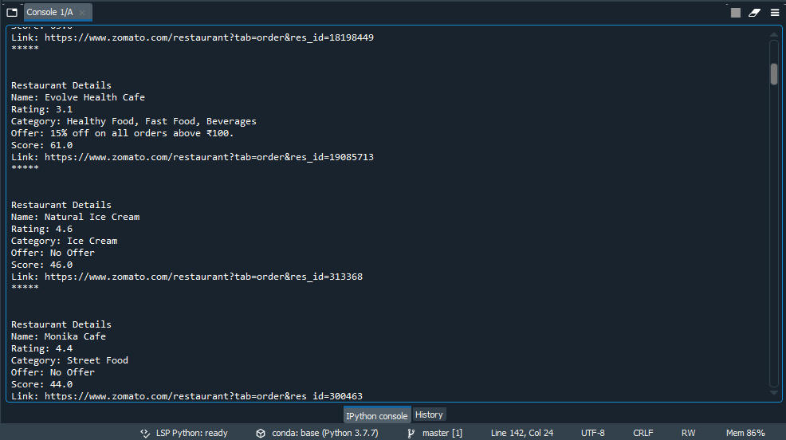
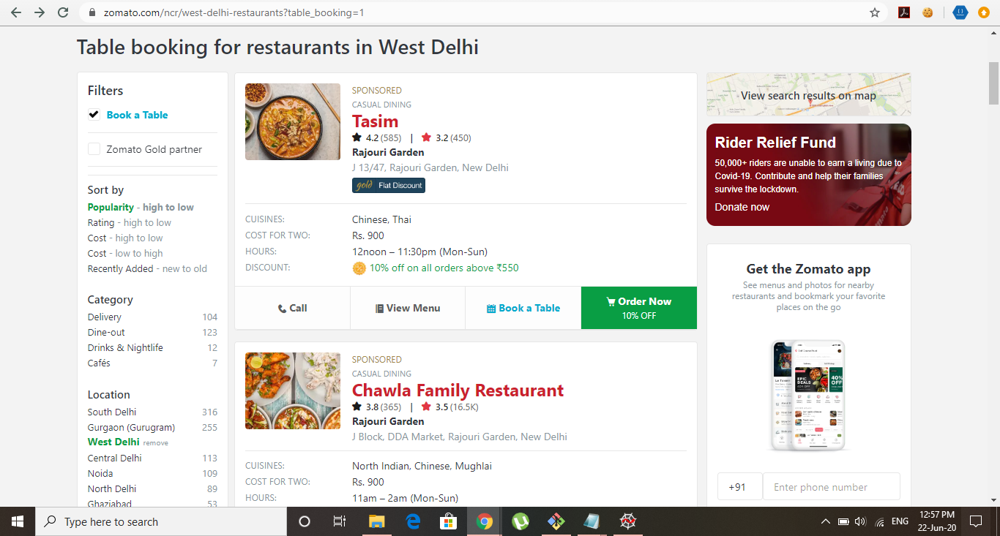
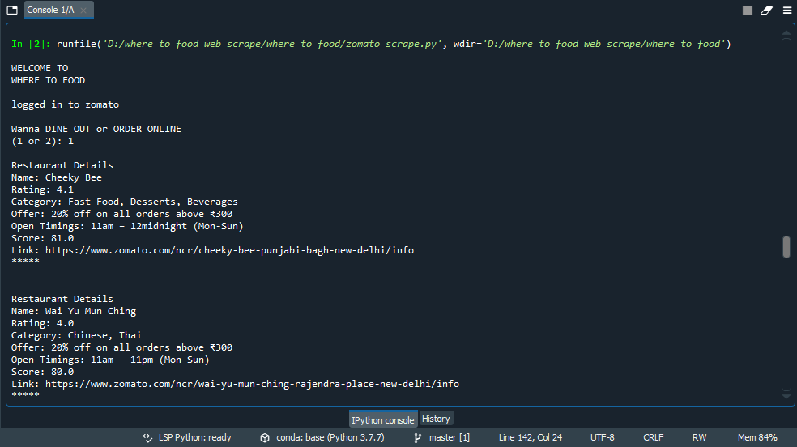
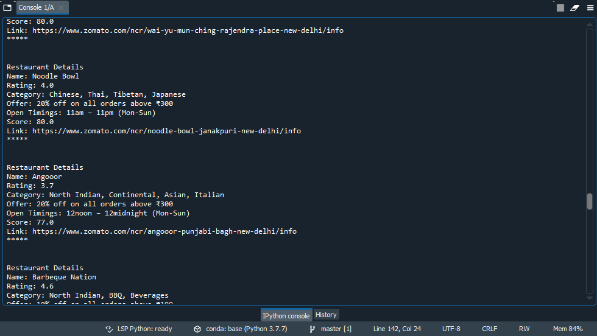
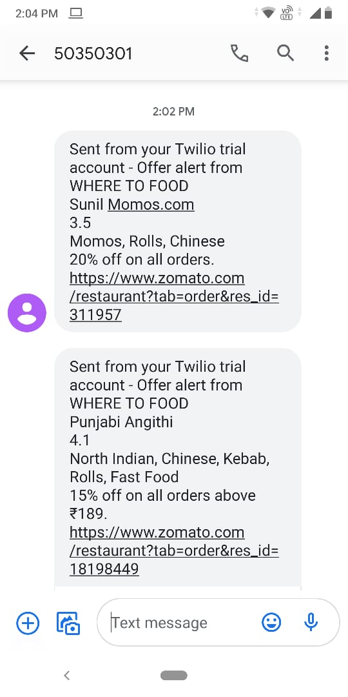

# **WHERE TO FOOD🌮**

**WHERE TO FOOD** is a **web scraping** based project that lists the restaurants available on **zomato**, with the restaurant with higher **rating** and more **offer** being listed at the top.

It calculates a score of the restaurant using the rating and offer provided by the restaurant. Higher the rating and offer, higher the score will be. The listing of the restaurants is done based on this score calculated.

It helps me save time in searching for a restaurant and also saves my money as I get restaurants with good offers listed at the top.

Also it has two option for **Online Order** and **Dine Out** restaurants. I can select what list I want to see.

I also get some info about the restaurant such as it's **category** and **open timings** of the restaurant.
But the best thing is that it also gives the **direct link to the restaurant's order page on zomato** so i can simply order by clicking on the link instead of searching for the restaurant manually.

## SMS ALERT

I have also added a feature that **automatically alerts me via a text SMS** whenever a restauraunt is providing an awesome deal. **So now i never miss any _steal deal_**.

The system checkes for the offers after every hour and if the score is above 120(say) then it sends a sms at my phone number and notify me for a great deal.
I don't even need to run the script as it automatically notifies me on my phone.

For the sms alerts, I am using [**TWILIO**](https://www.twilio.com/) messaging service (NOTE: I am using a trial version). I use **API** for interaction with the twilio website.

screenshot of the sms alert i got from my system

## INPUTS

User can give **1** as input for **dine out** options and **2** for **online order** options.

## SCREEN SNAPS

zomato page for online order accepting restaurants

listing of the restaurants in my project

zomato page for dine out restaurants

listing of the restaurants in my project

offer alert via sms

## REFERENCE and SERVICE I USED

[**TECH RAJ** (youtube)](https://www.youtube.com/watch?v=r1T_Q24Ucng&feature=youtu.be)

[**TWILIO**](https://www.twilio.com/)

## CREATED BY

**ARCHIT GUPTA**
 